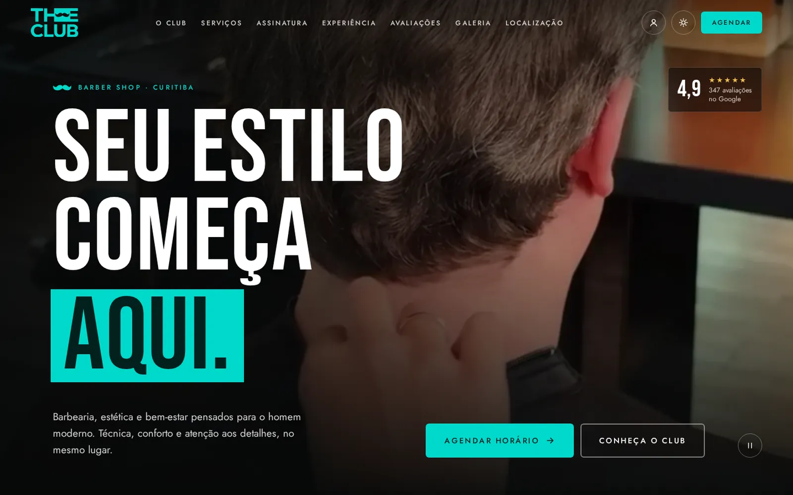

<p align="center">
  
</p>

<p align="center">
  
  
  
  
</p>

<p align="center">
  Demo de site para uma barbearia real de Curitiba, com agendamento online em etapas, área do cliente e planos de assinatura, pensada para transmitir a experiência premium da marca.
</p>

<p align="center">
  <a href="https://lorenzo-or7.github.io/theclub-demo/"><b>🔗 Acessar o site</b></a>
</p>

---

## 🖥️ Preview

<p align="center">
  <a href="https://lorenzo-or7.github.io/theclub-demo/"></a>
</p>

---

## 📌 Sobre o projeto

A The Club é uma barbearia que vende experiência: corte, barba, estética e bem-estar no mesmo lugar. A proposta foi criar um site à altura disso, com vídeo em tela cheia, tipografia forte e um agendamento completo dentro do próprio site, sem depender de aplicativos de terceiros.

O visual parte do preto profundo com o **ciano** da marca como destaque, tipografia condensada em caixa alta e vídeos reais do salão.

---

## ✨ Funcionalidades

- 🎬 Hero com vídeo em tela cheia
- ✂️ Menu de serviços por categoria (cabelo, barba, detalhes e bem-estar)
- 💳 Planos de assinatura com filtro pelo que entra no plano
- ♿ Seção de inclusão e acessibilidade
- 🖼️ Equipe, avaliações e galeria com lightbox
- 📅 Agendamento em 4 etapas: serviço, profissional, data e confirmação
- 👤 Área "Meus agendamentos"
- 📍 Localização com mapa e WhatsApp
- 📱 Layout responsivo

---

## 🛠️ Tecnologias

- **HTML5** para a estrutura
- **CSS3** para identidade visual, responsividade e animações
- **JavaScript** puro para as interações
- **GitHub Pages** para hospedagem

CSS e JavaScript separados em `css/` e `js/`, com fontes e vídeos locais.

---

## ⚙️ Como rodar

Não precisa instalar nada: baixe o repositório e abra o arquivo `index.html` no navegador.

```bash
git clone https://github.com/lorenzo-or7/theclub-demo.git
```

> Este é um projeto demonstrativo: os agendamentos ficam salvos apenas no navegador (localStorage) e não há integração com a agenda real da barbearia.

---

## 👨‍💻 Autor

<p>
  Feito por <b>Lorenzo Orsetti</b><br/>
  <a href="https://lorenzo-or7.github.io">
    
  </a>
  <a href="https://www.linkedin.com/in/lorenzo-orsetti-031906349/">
    
  </a>
  <a href="https://github.com/lorenzo-or7">
    
  </a>
</p>

<p align="center">
  
</p>
